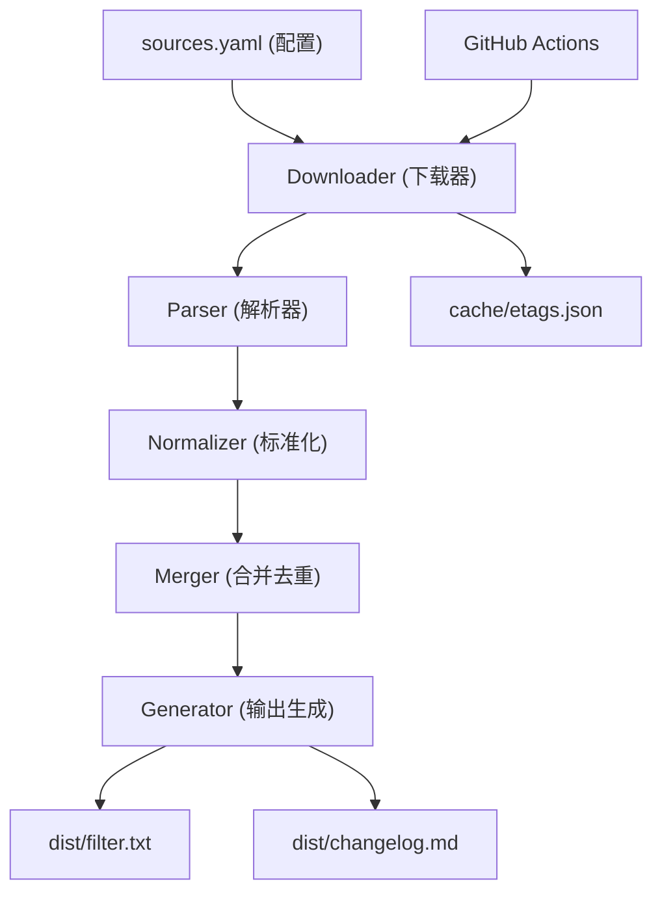
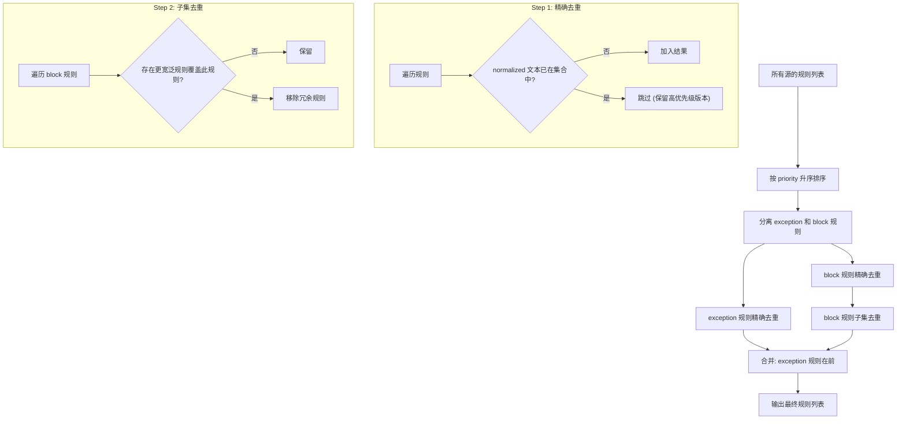

# Adblock Filter Aggregator

Feature Name: adblock-filter-aggregator
Updated: 2026-08-02

## Description

本系统是一个 Python 实现的广告过滤规则聚合器，从 6 个精选上游规则源收集规则，经解析、标准化、去重后输出一份统一的 adblock 格式过滤列表。系统通过 GitHub Actions 每 20 分钟自动运行，检测上游变更并自动提交更新。

## Architecture



### 数据流

1. GitHub Actions cron 触发器启动主脚本
2. 从 `sources.yaml` 读取 6 个上游源配置
3. Downloader 并发下载每个源的最新规则（带 ETag 条件请求）
4. Parser 解析 adblock 语法规则，剔除元数据注释
5. Normalizer 标准化规则（去空白、域名标准化）
6. Merger 按优先级合并去重，例外规则前置
7. Generator 生成输出文件 + 变更日志

## Components and Interfaces

### 1. Configuration (`config.py`)

负责加载和验证 `sources.yaml` 配置。

```yaml
# sources.yaml
sources:
  - name: EasyList
    url: https://easylist-downloads.adblockplus.org/easylist.txt
    priority: 1
    enabled: true
  - name: EasyPrivacy
    url: https://easylist-downloads.adblockplus.org/easyprivacy.txt
    priority: 2
    enabled: true
  # ... 共 6 个源

settings:
  output_dir: dist
  output_file: filter.txt
  changelog_file: changelog.md
  cache_dir: cache
  request_timeout: 30
  retry_delay: 5
  max_rule_length: 4000
  changelog_retention_days: 90
```

**接口**:

```python
@dataclass
class SourceConfig:
    name: str
    url: str
    priority: int
    enabled: bool

@dataclass
class AppConfig:
    sources: list[SourceConfig]
    output_dir: str
    output_file: str
    changelog_file: str
    cache_dir: str
    request_timeout: int
    retry_delay: int
    max_rule_length: int
    changelog_retention_days: int

def load_config(path: str = "sources.yaml") -> AppConfig: ...
```

### 2. Downloader (`downloader.py`)

异步 HTTP 下载器，支持重试和 ETag 条件请求。

```python
@dataclass
class DownloadResult:
    source: SourceConfig
    content: str
    rule_count: int
    status_code: int
    changed: bool      # 是否相比上一次有变化
    error: str | None

async def download_all(
    sources: list[SourceConfig],
    etags: dict[str, str],
    timeout: int,
    retry_delay: int,
) -> dict[str, DownloadResult]: ...

async def download_single(
    source: SourceConfig,
    etag: str | None,
    timeout: int,
    retry_delay: int,
) -> DownloadResult: ...
```

**关键行为**:
- 使用 `aiohttp` 并发下载所有源
- 首次下载无 ETag，全量获取
- 后续下载带 `If-None-Match` 头，304 响应表示无变化
- 失败重试 1 次，间隔 5 秒
- 更新 `cache/etags.json` 缓存

### 3. Parser (`parser.py`)

解析 adblock 语法规则，将原始文本转化为结构化规则对象。

```python
@dataclass
class Rule:
    raw: str           # 原始规则文本
    normalized: str    # 标准化后的规则文本
    type: str          # "block" | "exception" | "hide" | "header"
    source: str        # 来源名称
    priority: int      # 来源优先级

def parse_rules(raw_content: str, source: SourceConfig) -> list[Rule]: ...
def is_metadata_line(line: str) -> bool: ...
def classify_rule(line: str) -> str: ...
```

**规则分类**:
| 前缀 | 类型 | 说明 |
|------|------|------|
| `@@` | exception | 例外/白名单规则 |
| `##` | hide | 元素隐藏规则 |
| `!` | header | 注释/元数据 |
| `[` | header | AdGuard 元数据块标记 |
| 其他 | block | 网络拦截规则 |

### 4. Normalizer (`normalizer.py`)

规则标准化，确保语义相同的规则归一化为同一形式。

```python
def normalize_rule(rule_text: str) -> str: ...
```

**标准化步骤**:
1. 去除首尾空白
2. 折叠连续空白为单个空格
3. 统一 URL 编码（`%2F` <-> `/` 等等价形式）
4. 去除 `www.` 域名前缀（规则匹配层面等价时）
5. 统一大小写（规则域名部分）

### 5. Merger (`merger.py`)

合并多条规则并去重。

```python
class RuleMerger:
    def __init__(self): ...
    def add_source(self, rules: list[Rule]) -> None: ...
    def merge(self) -> list[Rule]: ...

def deduplicate(rules: list[Rule]) -> list[Rule]: ...
```

**合并去重算法**:



**子集去重策略**:
- 对 `||domain^` 模式的规则，检测是否存在 `||parent.domain^` 已覆盖该域名
- 对 `||domain/path` 模式的规则，检测是否存在 `||domain^` 更宽泛的规则
- 子集检测仅在 `priority` 更高的源规则中查找覆盖关系
- 时间复杂度通过域名索引优化为 O(n*m)，其中 m 为共享域名前缀的规则数

**关键行为**:
- 按 `priority` 升序排列源（priority=1 的 EasyList 最先处理，优先级最高）
- 同一条 `normalized` 规则的首次出现被保留，后续重复被丢弃
- 由于 priority 低的源先处理，优先保留高优先级（priority 数值最小）源的规则
- 例外规则（`@@`）聚合在输出开头
- 对子集规则进行检测：若规则 A 覆盖了规则 B 的场景（如 `||example.com^` 覆盖 `||ads.example.com^`），则去除冗余的 B

### 6. Generator (`generator.py`)

生成最终输出文件和变更日志。

```python
@dataclass
class GenerationResult:
    total_rules: int
    exception_rules: int
    by_source: dict[str, int]
    timestamp: str

def generate_output(
    rules: list[Rule],
    sources: list[SourceConfig],
    output_dir: str,
    output_file: str,
) -> GenerationResult: ...

def generate_changelog(
    current: GenerationResult,
    previous: GenerationResult | None,
    changelog_path: str,
    retention_days: int,
) -> None: ...
```

**输出文件格式** (`dist/filter.txt`):

```text
[AdBlock Plus 2.0]
! Title: Adblock Filter Aggregator
! Expires: 20 minutes
! Last modified: 2026-08-02T12:00:00Z
! Total rules: 85000
! Sources: EasyList (45000), EasyPrivacy (12000), AdGuard Base (20000), ...
!
! ===== Exception Rules =====
@@||example.com^$document
...
! ===== Block Rules =====
||doubleclick.net^
...
```

### 7. CLI Entry Point (`main.py`)

主入口，编排完整流程。

```python
async def main() -> None:
    """主流程入口"""
    config = load_config()
    etags = load_etags(config.cache_dir)
    results = await download_all(config.sources, etags, ...)
    save_etags(config.cache_dir, results)
    
    if not any(r.changed for r in results.values()):
        print("No changes detected, skipping generation.")
        return
    
    merger = RuleMerger()
    for result in results.values():
        if result.content:
            rules = parse_rules(result.content, result.source)
            merger.add_source(rules)
    
    merged = merger.merge()
    result = generate_output(merged, config.sources, ...)
    generate_changelog(result, previous, ...)
```

### 8. GitHub Actions Workflow (`.github/workflows/update.yml`)

```yaml
name: Update Filter List
on:
  schedule:
    - cron: '*/20 * * * *'   # 每 20 分钟
  workflow_dispatch:          # 手动触发
concurrency:
  group: filter-update
  cancel-in-progress: false   # 防止并发

jobs:
  update:
    runs-on: ubuntu-latest
    steps:
      - uses: actions/checkout@v4
      - uses: actions/setup-python@v5
        with:
          python-version: '3.11'
          cache: 'pip'
      - run: pip install -r requirements.txt
      - run: python main.py
      - name: Commit and push
        run: |
          git config user.name "github-actions[bot]"
          git config user.email "github-actions[bot]@users.noreply.github.com"
          git add dist/ cache/
          git diff --staged --quiet || git commit -m "Update filter list [$(date -u +%Y-%m-%dT%H:%M:%SZ)]"
          git push
```

## Data Models

### ETag 缓存 (`cache/etags.json`)

```json
{
  "EasyList": "\"abc123-def456\"",
  "EasyPrivacy": "\"xyz789-ghi012\"",
  "last_updated": "2026-08-02T12:00:00Z"
}
```

### 变更日志 (`dist/changelog.md`)

```markdown
## 2026-08-02 12:00 UTC
- Total rules: 85,230 (+128 / -45)
- Sources:
  - EasyList: 45,000 rules (updated)
  - EasyPrivacy: 12,000 rules (unchanged)
  - AdGuard Base: 20,000 rules (updated)
  - AdGuard DNS: 5,500 rules (unchanged)
  - Peter Lowe's List: 2,500 rules (unchanged)
  - Anti-AD: 230 rules (unchanged)
```

## Correctness Properties

1. **幂等性**: 同一批上游数据多次运行产生相同的输出文件
2. **去重完整性**: 不存在两条 `normalized` 值相同的规则
3. **优先级一致性**: 重复规则始终保留 priority 数值最小的源的版本
4. **例外规则前置**: 所有 `exception` 类型规则出现在输出文件开头
5. **无变更跳过**: 当所有源 ETag 未变时，不重新生成输出且不产生 git 提交
6. **隔离性**: 单个源的下载/解析失败不影响其他源的处理

## Error Handling

| 场景 | 处理策略 |
|------|----------|
| 上游源不可达 | 记录错误日志，使用缓存的最新数据，继续处理其他源 |
| 上游源返回非 200/304 | 重试 1 次，仍失败则跳过该源 |
| 规则格式异常 | 跳过该行，记录 skip 计数 |
| 输出目录不可写 | 终止流程，GitHub Actions 日志记录错误 |
| 无任何源可用 | 不更新输出文件，保留上一版本 |
| GitHub push 失败 | Actions 自动标记 workflow 为 failed |

## Test Strategy

### 单元测试

| 模块 | 测试内容 |
|------|----------|
| `config.py` | 配置加载、默认值、格式校验 |
| `parser.py` | 各规则类型解析、元数据剔除、异常规则处理 |
| `normalizer.py` | 空白折叠、URL 编码统一、域名前缀去除 |
| `merger.py` | 去重正确性、优先级保留、例外规则排序 |

### 集成测试

| 场景 | 验证点 |
|------|--------|
| 端到端流程 | 使用 mock 数据验证完整管道输出 |
| 去重回归 | 固定输入集，验证去重结果稳定性 |
| ETag 变更检测 | 模拟 304 响应，验证跳过生成逻辑 |

### 兼容性测试

- 输出文件通过 adblock 语法 linter 校验
- 输出文件在 Adblock Plus 测试扩展中加载无错误
- 无单条规则超过 uBlock Origin 的 4000 字符限制

## References

[^1]: (Website) - [EasyList 官方文档](https://easylist.to/)
[^2]: (Website) - [Adblock Plus 过滤器语法文档](https://help.eyeo.com/adblockplus/how-to-write-filters)
[^3]: (Website) - [AdGuard 过滤器语法](https://adguard.com/kb/general/ad-filtering/create-own-filters/)
[^4]: (Website) - [uBlock Origin 维基](https://github.com/gorhill/uBlock/wiki)
