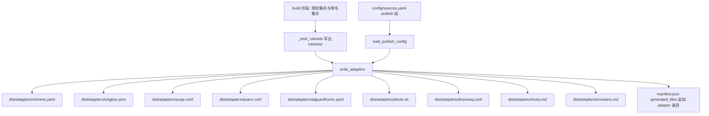

# 客户端适配产物 — 技术设计

Feature Name: client-adapter-outputs
Updated: 2026-09-25

## 描述

在现有构建流水线中新增一个「适配产物」阶段：读取已生成的规范规则集产物，为每个受支持客户端生成一个可粘贴或直接导入的适配文件，写入 `dist/adapters/`，登记进 `manifest.json`，随每日 CI 构建更新。适配产物只做「引用 + 配置」，不新增任何拦截判定；拦截范围完全来自被引用的规范规则集，与 DNS/连接层同源同一「应拦截纯域名」集合。

受支持客户端与产物固定如下：

| 客户端 | 产物 | 形态 | 引用的规范产物 |
| :--- | :--- | :--- | :--- |
| mihomo / Clash Meta | `adapters/mihomo.yaml` | `rule-providers` + `rules` 片段 | `rulesets/adblock_clash.yaml` |
| sing-box | `adapters/singbox.json` | `route.rule_set`(remote, source) + reject 片段 | `rulesets/adblock_singbox.json` |
| Surge | `adapters/surge.conf` | `DOMAIN-SET` 行 | `rulesets/adblock_surge_domain_set.txt` |
| Quantumult X | `adapters/quanx.conf` | `filter_remote` 行 | `rulesets/adblock_quanx*.list` |
| AdGuard Home | `adapters/adguardhome.yaml` | `filters` 片段 | `adblock_collection_full_domains.txt` |
| Pi-hole | `adapters/pihole.txt` | `adlists` 行 | `adblock_collection_full_dns.txt` |
| dnsmasq | `adapters/dnsmasq.conf` | `addn-hosts` 片段 | `adblock_collection_full_dns.txt` |
| 系统 hosts | `adapters/hosts.md` | 安装指引（含 URL） | `adblock_collection_full_dns.txt` / `_dns_ipv6.txt` |
| 浏览器扩展 | `adapters/browsers.md` | 订阅与导入指引 | `adblock_collection_full.txt` / `_jsdelivr.txt` / `ubo_enhance.txt` |

## 架构



适配阶段位于连接层规则集之后。生成顺序保证 Quantumult X 与 Surge 适配文件能看到 `_partNN` 分片名：先写 `rulesets/`，再扫描分片，最后写适配文件。

适配产物不参与规则计数，不进入 `_check_layers_invariant` 与 `_check_category_invariant`（这两项按 manifest 条目的 `name` 前缀与文件后缀筛选，适配条目使用独立前缀 `adapter_` 且不带 `rules` 字段）。

## 组件与接口

### 新增模块 `adblock_collection/adapters.py`

```python
@dataclass(frozen=True)
class PublishConfig:
    repository: str          # "wansheng8/GZ"
    branch: str              # "main"
    raw_base: str            # 派生或覆盖，以 "/" 结尾
    mirror_base: str         # 派生或覆盖，以 "/" 结尾

def load_publish_config(config_path: Path) -> PublishConfig: ...

def write_adapters(
    output_dir: Path,
    publish: PublishConfig,
    manifest: list,
    *,
    rulesets_dir: Path | None = None,
) -> dict[str, int]: ...
```

- `load_publish_config` 读取 `config/sources.yaml` 顶层 `publish` 段；缺省时用内置默认仓库与分支，保证离线与夹具构建可复现。
- `write_adapters` 负责写文件与追加 manifest 条目；`rulesets_dir` 存在时生成连接层适配，不存在时跳过并记 `WARNING`。
- 每个客户端一个纯函数，便于单测：`_adapter_mihomo`、`_adapter_singbox`、`_adapter_surge`、`_adapter_quanx`、`_adapter_adguardhome`、`_adapter_pihole`、`_adapter_dnsmasq`、`_adapter_hosts_guide`、`_adapter_browsers_guide`，均返回 `str`（在内存中拼好后一次写入，保证确定性）。

### 配置 `config/sources.yaml` 新增顶层 `publish` 段

```yaml
publish:
  repository: wansheng8/GZ
  branch: main
  # 可选覆盖；留空则按下述规则派生
  raw_base: ""
  mirror_base: ""
```

派生规则：

```text
raw_base    = https://raw.githubusercontent.com/{repository}/{branch}/dist/
mirror_base = https://cdn.jsdelivr.net/gh/{repository}@{branch}/dist/
```

`raw_base` / `mirror_base` 非空时原样使用，用于本地镜像或前向分支。

### CLI 集成 `adblock_collection/cli.py`

在 `_emit_rulesets`（`gen_dns and gen_rulesets` 分支）之后调用：

```python
if gen_dns:
    publish = load_publish_config(ctx.config_path)
    write_adapters(target, publish, manifest, rulesets_dir=(target / "rulesets") if ctx.flags.gen_rulesets else None)
```

`ctx.config_path` 已由构建上下文持有，无需新增参数。`--no-dns` 构建不生成适配产物（适配产物全部引用 DNS/连接层产物）。

### Manifest 条目

```json
{
  "name": "adapter_mihomo",
  "file": "adapters/mihomo.yaml",
  "format": "adapter",
  "target": "mihomo",
  "bytes": 512,
  "sha256": "..."
}
```

`bytes` 与 `sha256` 由现有 `write_manifest` 统一补齐；`target` 为新增可选字段。

## 适配产物规格

所有首部注释统一包含：标题、接入位置、规范基址、镜像基址。文件使用 LF 换行、UTF-8、无 BOM、无生成时间戳。

### mihomo / Clash Meta `mihomo.yaml`

```yaml
# Adblock Rule Collection — mihomo / Clash Meta 适配
# 用法：把 rule-providers 与 rules 两段合并进 config.yaml。
# 规范基址：{raw_base}rulesets/adblock_clash.yaml
# 镜像基址：{mirror_base}rulesets/adblock_clash.yaml
rule-providers:
  adblock:
    type: http
    behavior: domain
    format: yaml
    url: "{raw_base}rulesets/adblock_clash.yaml"
    path: ./ruleset/adblock.yaml
    interval: 86400
rules:
  - RULE-SET,adblock,REJECT
```

### sing-box `singbox.json`

```json
{
  "route": {
    "rule_set": [
      {
        "type": "remote",
        "tag": "adblock",
        "format": "source",
        "url": "{raw_base}rulesets/adblock_singbox.json",
        "update_interval": "1d"
      }
    ],
    "rules": [{"rule_set": "adblock", "action": "reject"}]
  }
}
```

`format: source` 允许 sing-box 直接下载源 JSON 并自行编译，用户无需手动 `rule-set compile`。参考 sing-box 官方 `rule-set` 文档（见 References）。

### Surge `surge.conf`

```ini
# Adblock Rule Collection — Surge 适配
# 用法：把下面一行加入配置文件的 [Rule] 段。
# 规范基址：{raw_base}rulesets/adblock_surge_domain_set.txt
DOMAIN-SET,{mirror_base}rulesets/adblock_surge_domain_set.txt,REJECT
```

### Quantumult X `quanx.conf`

```ini
# Adblock Rule Collection — Quantumult X 适配
# 用法：把下列 filter_remote 行加入配置文件。
filter_remote = {mirror_base}rulesets/adblock_quanx.list, tag=Adblock, force-remote-filter=1
```

当 `rulesets/adblock_quanx_partNN.list` 存在时，逐行追加对应 `filter_remote`（`tag=Adblock-N`），`N` 由分片名尾部序号决定。

### AdGuard Home `adguardhome.yaml`

```yaml
# Adblock Rule Collection — AdGuard Home 适配
# 用法：把 filters 片段合并进 AdGuardHome.yaml 的 filters 段后重启。
filters:
  - enabled: true
    url: {raw_base}adblock_collection_full_domains.txt
    name: Adblock Collection (DNS domains)
```

按已确认事项，不生成放行部分；放行由用户按需单独导入 `dns_allow.txt`。

### Pi-hole `pihole.txt`

```text
# Adblock Rule Collection — Pi-hole 适配（adlists）
{raw_base}adblock_collection_full_dns.txt
```

内容为逐行一个列表 URL，可直接作为 `adlists.list` 的补充行。

### dnsmasq `dnsmasq.conf`

```ini
# Adblock Rule Collection — dnsmasq 适配
# dnsmasq 不能直接拉取远程 URL，请先把 hosts 文件下载到本地：
#   curl -o /etc/dnsmasq.d/adblock_collection_full_dns.txt {raw_base}adblock_collection_full_dns.txt
addn-hosts=/etc/dnsmasq.d/adblock_collection_full_dns.txt
```

### 系统 hosts `hosts.md`

指引型产物：给出 hosts 文件 URL（IPv4 与 IPv6）与 Windows、macOS、Linux、Android 的安装路径与命令，不复制 53 万行域名。

### 浏览器扩展 `browsers.md`

指引型产物：给出 uBlock Origin、AdGuard、Adblock Plus 的订阅地址（完整版 raw 与 jsDelivr、增强层），以及导入步骤与「DNS 设备只导一个文件」提醒。

## 数据模型

- `PublishConfig`：不可变数据类，承载仓库、分支与两套基址。
- manifest 适配条目：`name` / `file` / `format="adapter"` / `target` / `bytes` / `sha256`。
- 无新增持久化状态；适配产物由规范产物与配置纯函数派生。

## 正确性属性

1. **集合封闭**：`dist/adapters/` 恰好包含声明的 9 个文件，文件名固定。
2. **仅引用不含规则**：任一适配文件都不包含以 `||`、`@@`、`##` 开头的规则行；拦截范围全部来自被引用 URL。
3. **基址一致**：适配文件中出现的所有 URL 均以配置的 `raw_base` 或 `mirror_base` 开头，且路径指向实际存在的 manifest 文件。
4. **确定性**：相同配置与相同规范产物在多次运行中生成逐字节一致的适配文件。
5. **既有产物不变**：适配阶段不修改任何既有产物的内容与语义。
6. **索引完整**：每个适配文件都有 manifest 条目，且 `sha256` 与其内容一致。

## 错误处理

| 场景 | 处理 |
| :--- | :--- |
| `publish` 段缺失 | 使用内置默认仓库与分支，构建继续 |
| `publish` 段字段缺失或为空 | 用默认值补齐；两套基址始终可派生 |
| `publish` 段不是映射 | 抛 `BuildError`，构建以退出码 3 终止 |
| `rulesets/` 不存在（`--no-rulesets`） | 跳过四个连接层适配，记 `WARNING`，其余适配照常生成 |
| 适配文件写入失败 | 抛 `OSError`，构建以非零退出码终止 |
| 分片文件缺失 | 只写基础规则集引用，不写分片行 |

## 测试策略

1. `tests/test_adapters.py`：
   - 每个适配函数的结构断言（JSON 可解析、YAML 键存在、行前缀正确、URL 归属两套基址之一）；
   - `pyload` 解析 `singbox.json` 为 dict，校验 `route.rule_set[0].format == "source"`；
   - YAML 解析 `mihomo.yaml` 与 `adguardhome.yaml`；
   - 断言适配文件不含 `||`/`@@` 规则行；
   - 确定性：同一输入调用两次，结果字符串相等；
   - 分片联动：构造 `adblock_quanx_part01.list` 后，`quanx.conf` 含两条 `filter_remote`。
2. `tests/test_collection.py` 或新用例：构建后 manifest 含 9 个 `format="adapter"` 条目，`file` 前缀为 `adapters/`。
3. 基线：`tests/baseline/{m2,m3}` 重生成以纳入 `adapters/`（适配产物确定性，适合做字节基线）；若夹具不启用规则集，则对应连接层适配被跳过。
4. 现有 `ruff check .`、`pytest -q`、`python3 -m adblock_collection lint` 全绿；CI 不新增网络请求。
5. 文档同步：`README.md` 与 `docs/GENERATED_RULES.md` 增补 `dist/adapters/` 一览与获取地址。

## 参考资料

[^1]: (`adblock_collection/writer.py`) — 规范规则集写出与分片逻辑
[^2]: (`adblock_collection/cli.py`) — 构建阶段编排与 manifest 组装
[^3]: (`docs/GENERATED_RULES.md`) — 现有产物语法与用法
[^4]: (Website) - [sing-box rule-set 配置](https://sing-box.sagernet.org/configuration/rule-set/)
[^5]: (File) - `config/sources.yaml` 现有顶层配置段
[^6]: (File) - `.monkeycode/specs/client-adapter-outputs/requirements.md` 对应需求文档
