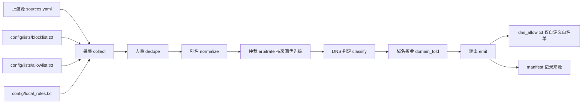

# 自定义黑白名单目录 — 技术设计

Feature Name: custom-lists
Updated: 2026-09-20

## 1. 描述

本设计在现有「上游采集 + `config/local_rules.txt` 本地增强」之上，引入固定的自定义名单目录 `config/lists/`，其中 `blocklist.txt` 承载自定义阻断、`allowlist.txt` 承载自定义放行。两文件在去重之前作为独立来源并入规则集，参与去重、仲裁、DNS 判定、质量门禁与误杀回归。

关键变化是 DNS 白名单产物的语义：`dns_allow.txt` 由「上游例外派生」改为「自定义白名单直出」，`manifest.json` 记录其来源。同时 DNS 阻断集合的例外来源收敛为自定义白名单，上游例外不再参与 DNS 层的剔除决策；上游例外的冲突处理仍由仲裁阶段完成。

### 1.1 已确认决策

- 自定义白名单以 `@@` 例外规则并入规则集，与上游同权参与流水线。
- `dns_allow.txt` 不再由上游例外派生，只反映自定义白名单。
- DNS 阻断集合不再因上游例外规则剔除域名，例外来源收敛为自定义白名单。
- 名单目录采用固定两文件：`config/lists/blocklist.txt` 与 `config/lists/allowlist.txt`。

### 1.2 优先级规则

| 优先级 | 规则类别 | 说明 |
|---|---|---|
| 1（最高） | 自定义白名单整域全局例外 | 用户显式放行 |
| 2 | 自定义黑名单整域阻断 | 用户显式阻断，覆盖上游例外 |
| 3 | 上游整域全局例外 | 上游显式放行 |
| 4 | 上游 `$important` 整域阻断 | 现有行为 |
| 5（最低） | 上游普通整域阻断 | 现有行为 |

## 2. 架构



自定义名单在 `collect` 阶段末尾追加，位于 `dedupe` 之前，确保与上游规则同权去重；来源名称用于仲裁与白名单筛选。

## 3. 组件与接口

### 3.1 自定义名单文件

- `config/lists/blocklist.txt`：标准 Adblock 语法，示例 `||ads.example.com^`、`||track.example.com^$script,third-party`、`example.com##.ad-slot`。
- `config/lists/allowlist.txt`：标准 Adblock 例外语法，示例 `@@||example.com^`、`@@||cdn.example.com^`。
- 两文件均为可选；缺失或为空按零条处理。

### 3.2 名单加载 `adblock_collection/merge.py`

```python
CUSTOM_LIST_FILES = (
    ("LocalBlocklist", "lists/blocklist.txt"),
    ("LocalAllowlist", "lists/allowlist.txt"),
)
```

- `load_custom_lists(config_path) -> list[tuple[str, list[Rule]]]`：逐文件读取，跳过 `#` 与 `!` 注释，调用 `parse_source_cached`（来源名分别为 `LocalBlocklist` / `LocalAllowlist`），缺失或读取失败记 warning 并跳过。
- `merge_sources` 在现有 `config/local_rules.txt` 处理之后调用该函数，按顺序追加到 `result["all"]`。

### 3.3 来源优先级 `adblock_collection/arbitrate.py`

`arbitrate` 按域名分组后按优先级分层裁决，先命中者胜出：

1. 若存在 `LocalAllowlist` 的整域全局例外，胜出，其余整域阻断（含自定义黑名单）记为败出，reason 记为「自定义白名单优先于阻断」。
2. 否则若存在 `LocalBlocklist` 的整域阻断，胜出，上游例外与上游整域阻断记为败出，reason 记为「自定义黑名单优先于上游规则」。
3. 否则沿用现有「上游整域全局例外 > `$important` 阻断 > 普通阻断」。

新增 `_is_custom_block(rule)` 判定来源为 `LocalBlocklist` 的单域名网络阻断（含带修饰符）。

### 3.4 DNS 阻断集合与白名单 `adblock_collection/writer.py`

- `_blocked_domains(rules, policy)` 调整为：

```python
blocked = {符合 dns_policy 的整域阻断域名}     # 含上游与 LocalBlocklist
custom_allow = {来源为 LocalAllowlist 的整域全局例外域名}
blocked -= custom_allow
return blocked
```

- 新增 `_custom_allow_domains(rules)`：仅返回 `LocalAllowlist` 来源的整域全局例外域名。
- `write_dns_allow` 改为接收域名集合（由 `_custom_allow_domains` 提供），不再自行从全部规则收集。
- `cli._emit_dns_allow` 传入自定义白名单域名集合，并将 `manifest` 条目标记 `source: custom_allowlist`。
- 上游例外在该阶段不再剔除任何域名；整域阻断与整域例外的同域冲突由 `arbitrate` 阶段裁决，避免产物出现相互抵消的规则。

### 3.5 校验 `adblock_collection/merge.py` 与 `adblock_collection/lint.py`

- 复用 `validate_local_rules` 的通配误伤规则，新增 `validate_custom_lists(config_path)`，对两文件逐行校验；命中则构建阻断并报告文件名与行号。
- `lint` 子命令在未显式 `--rules` 时默认校验 `config/lists/blocklist.txt`、`config/lists/allowlist.txt` 与 `config/local_rules.txt`。

### 3.6 元数据

- `manifest.json`：`dns_allow` 条目增加 `"source": "custom_allowlist"`。
- `build_report.json`：`metrics` 增加 `local_blocklist_rules` 与 `local_allowlist_rules` 计数。

## 4. 数据模型

`Rule` 模型不变，来源通过既有 `source` / `sources` 字段表达。自定义名单来源常量：

| 来源名 | 文件 | 作用 |
|---|---|---|
| `LocalBlocklist` | `config/lists/blocklist.txt` | 自定义阻断 |
| `LocalAllowlist` | `config/lists/allowlist.txt` | 自定义放行 |
| `LocalRules` | `config/local_rules.txt` | 既有本地增强（不变） |

## 5. 正确性属性

- **P1**：`dns_allow.txt` 的每个域名都来自 `LocalAllowlist` 的整域全局例外。
- **P2**：`LocalBlocklist` 的整域阻断域名不会出现在 DNS 阻断集合中，除非同域出现在 `LocalAllowlist`。
- **P3**：上游例外规则不影响 DNS 阻断集合的域名判定。
- **P4**：每条被移除的整域规则都对应一条仲裁记录（无静默丢失）。
- **P5**：自定义名单缺失或为空时，构建成功且产物与未启用该功能时一致。

## 6. 错误处理

| 场景 | 处理 |
|---|---|
| 名单文件不存在 | info 日志，跳过 |
| 名单文件读取失败 | warning 日志，跳过并继续 |
| 名单含通配误伤规则 | 阻断构建，报告文件与行号 |
| 名单含语法错误 | `lint` 报告问题；构建按现有规则不因语法错误阻断 |
| 白名单为空 | 产出零条 `dns_allow.txt`，构建成功 |

## 7. 测试策略

- 单元测试：`tests/test_local_lists.py` 覆盖加载（缺失、空、注释、正常）、来源名标记与通配校验。
- 仲裁测试：`tests/test_arbitrate.py` 覆盖自定义白名单 > 自定义黑名单 > 上游例外的优先级。
- DNS 测试：`tests/test_collection.py` 覆盖 `_blocked_domains` 的剔除与重加规则、`dns_allow` 仅含自定义域名。
- CLI 测试：`lint` 默认校验名单目录；`build` 元数据含来源与计数。
- 基线：更新 `tests/baseline/m2` 与 `m3` 受影响文件（`dns_safety.json`、`manifest.json`）。
- 端到端：本地 `build --offline --split-by-category` 校验门禁、回归与往返不变量通过。

## 8. 迁移与文档

- 既有 `config/local_rules.txt` 继续生效；文档建议把纯阻断类规则迁移到 `config/lists/blocklist.txt`。
- 更新 `README.md`、`docs/OPS.md`、`docs/SYNTAX.md`，说明名单目录位置、语法与优先级。

## 9. 参考

- [^1]: requirements.md，当前工作区 内的 `/.monkeycode/specs/custom-lists/requirements.md`
- [^2]: (adblock_collection/merge.py#L108) 现有 `local_rules.txt` 并入逻辑
- [^3]: (adblock_collection/arbitrate.py#L60) 现有整域仲裁
- [^4]: (adblock_collection/writer.py#L128) 整域全局例外判定
- [^5]: (adblock_collection/writer.py#L151) `_blocked_domains` 剔除逻辑
- [^6]: (adblock_collection/writer.py#L189) `write_dns_allow`
- [^7]: (adblock_collection/cli.py#L307) `_emit_dns_allow`
- [^8]: (adblock_collection/merge.py#L371) `validate_local_rules`
