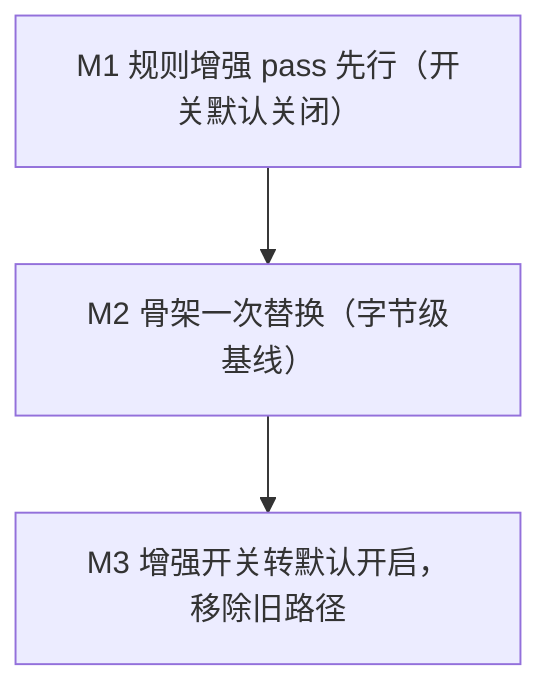

# 流水线重构与规则处理增强 — 技术设计

Feature Name: pipeline-refactor
Updated: 2026-09-19

## 1. 描述

本设计把 `adblock_collection` 的构建流程拆成两个可控里程碑：先以开关方式接入规则处理增强，再把单体编排替换为显式阶段化流水线。骨架替换阶段以字节级基线锁住输出，增强开关关闭时产物与现状完全一致；增强开关启用后允许语义等价变化，全部差异进入构建差异报告。

设计对齐三项已确认决策：

- 产物变化按阶段放开：骨架重构字节级等价，规则增强由开关控制。
- `rules.jsonl` 写入 `.cache/build/` 或 CI 工件，不进入版本控制。
- 规则增强先行，骨架一次替换。

## 2. 架构

### 2.1 目标流水线


### 2.2 里程碑



### 2.3 分层

- **编排层**：`Pipeline` 按顺序执行 `Stage`，负责计时、计数与报告收集。
- **能力层**：现有 `merge` / `rules` / `dns_policy` / `provenance` 中的函数包装为阶段，逻辑保持不动。
- **增强层**：新增 `aliases` / `arbitrate` / `domain_fold` 与扩展后的 `classify`，全部为纯函数，可由开关决定是否插入阶段序列。
- **I/O 层**：采集阶段（网络与缓存）与输出阶段（写文件）是仅有的副作用边界。

`Pipeline` 不感知具体阶段，阶段序列由 `cli.build` 按标志组装，便于测试时替换为桩阶段。

## 3. 组件与接口

### 3.1 编排接口（M2 引入）

```python
@dataclass(frozen=True)
class BuildFlags:
    alias_normalize: bool = False
    resolve_conflicts: bool = False
    per_rule_classify: bool = False
    domain_fold: bool = False
    dry_run: bool = False

@dataclass
class BuildContext:
    config_path: Path
    output_dir: Path
    dns_policy: dict
    security_policy: dict
    flags: BuildFlags

class Stage(Protocol):
    name: str
    def __call__(self, rules: list[Rule], ctx: BuildContext) -> list[Rule]: ...

class Pipeline:
    def __init__(self, stages: list[Stage]) -> None: ...
    def run(self, rules: list[Rule], ctx: BuildContext) -> tuple[list[Rule], PipelineReport]: ...
```

### 3.2 增强 pass 接口（M1 引入）

```python
def normalize_aliases(rules: list[Rule]) -> tuple[list[Rule], AliasReport]: ...
def arbitrate(rules: list[Rule], allow: set[str]) -> tuple[list[Rule], list[ArbitrationRecord]]: ...
def classify_per_rule(rules: list[Rule]) -> list[Rule]: ...
def fold_domains(rules: list[Rule]) -> tuple[list[Rule], FoldReport]: ...
```

每个增强 pass 接收并返回规则集，报告对象随规则集返回，由编排层汇总写入构建报告。

`arbitrate` 的仲裁范围限定为整域规则：仅当目标是纯域名且选项集合是 `{"important"}` 的子集时参与。整域全局例外的判定复用 `writer._is_global_domain_exception`，作用域与路径例外保持原样输出。仲裁记录写入 `dist/arbitration.json`，条数汇总进构建报告。

`fold_domains` 是 `merge.remove_redundant_domains` 的增强实现：后者改为以 `protect_exception_children=False` 调用前者，保持 `--redundant` 的既有产物字节级不变；新开关 `--domain-fold` 启用 `protect_exception_children=True`，当子域自身存在精确例外时保留其阻断规则，并把折叠条数与域名清单写入 `dist/domain_fold.json`。

### 3.3 中间产物接口

```python
def dump_rules_jsonl(rules: list[Rule], path: Path) -> int: ...
def load_rules_jsonl(path: Path) -> list[Rule]: ...
def emit_from_jsonl(jsonl_path: Path, output_dir: Path, ctx: BuildContext) -> int: ...
```

`dump_rules_jsonl` 位于仲裁与化简之后、输出之前，每次构建无条件写入 `.cache/build/rules.jsonl`；`emit_from_jsonl` 复用现有 writer，不重新下载。

### 3.4 基线比对接口

```python
def compare_baseline(old_dir: Path, new_dir: Path) -> BaselineDiff: ...
```

`BaselineDiff` 含每个文件的字节差异标记、首个差异行号、差异行数。骨架迁移阶段该比对为门禁；迁移完成后转为诊断工具。

`dist/sources_status.json` 含 `generated_at` 时间戳（`cli.py:475`），是唯一带时间戳的产物，字节比对时 SHALL 对该字段单独归一，其余产物逐字节比较。

### 3.5 模块落点

| 模块 | 职责 | 里程碑 |
|------|------|--------|
| `adblock_collection/build_pipeline.py` | `BuildFlags` / `BuildContext` / `Stage` / `Pipeline` / `PipelineReport` | M2 |
| `adblock_collection/aliases.py` | 选项别名归一化 | M1 |
| `adblock_collection/arbitrate.py` | 例外与冲突确定性仲裁 | M1 |
| `adblock_collection/domain_fold.py` | 域名层级折叠 | M1 |
| `adblock_collection/rules.py` | 新增 `classify_per_rule` 多信号逐条分类 pass（保留 `_classify` 供解析期使用） | M1 |
| `adblock_collection/rules_jsonl.py` | 中间产物读写与派生 | M2 |
| `adblock_collection/baseline.py` | 字节级基线比对 | M2 |
| `adblock_collection/cli.py` | 标志解析、阶段组装、报告落盘 | M1/M2 |

## 4. 数据模型

### 4.1 既有 `Rule`

沿用 `rules.py:72` 的 `Rule`，去重与等价只依赖 `norm`。增强 pass 不新增可变全局状态。

### 4.2 `rules.jsonl` 行结构

```json
{
  "raw": "||ads.example.com^$third-party",
  "norm": "||ads.example.com^$third-party",
  "kind": "network",
  "category": "ads",
  "is_exception": false,
  "is_important": false,
  "is_badfilter": false,
  "domains": ["ads.example.com"],
  "sources": ["EasyList"],
  "options": {"third-party": ""}
}
```

字段与 `pipeline.save_parsed` 的阶段缓存格式保持同构，便于复用读写逻辑。

### 4.3 报告对象

```python
@dataclass
class StageReport:
    name: str
    in_rules: int
    out_rules: int
    elapsed_ms: int

@dataclass
class AliasReport:
    normalized: int
    collapsed: int

@dataclass
class ArbitrationRecord:
    target: str
    winner: str
    losers: list[str]
    reason: str

@dataclass
class FoldReport:
    folded_domains: list[str]
    before: int
    after: int
```

## 5. 正确性属性

- **P1 类型互斥完备**：网络层与元素隐藏层按 `kind` 划分且互斥，并集等于完整版规则数。
- **P2 DNS 等价**：`_dns_abp.txt` 域名集合等于 `_domains.txt` 域名集合。
- **P3 类别并集**：类别拆分产物并集等于完整版。
- **P4 确定性**：相同输入、相同标志产生相同输出（阶段无随机、无时间依赖）。
- **P5 别名幂等**：`normalize_aliases` 连续执行两次结果一致。
- **P6 仲裁全序**：整域全局例外 > `$important` 整域阻断 > 普通整域阻断，同一整域目标结果唯一；作用域与路径例外不参与整域仲裁。
- **P7 折叠单调**：`fold_domains` 不扩大拦截范围，折叠后域名集合是被折叠前集合的子集或等价集。
- **P8 精确白名单**：裸域放行不影响子域阻断。
- **P9 往返一致**：对每种输出格式，解析序列化结果与源规则在 `norm` 语义上一致。
- **P10 字节基线**：增强开关关闭时，产物与重构前逐字节一致；`sources_status.json` 的 `generated_at` 字段单独归一后比较。

## 6. 错误处理

| 场景 | 处理 |
|------|------|
| 阶段抛异常 | 记录阶段名与规则数，以退出码 3 结束；不写入半成品产物 |
| 不变量破坏（P1/P2/P3） | 记录差异计数，以退出码 3 结束 |
| 往返校验失败（P9） | 指出格式与规则，以退出码 3 结束 |
| 字节基线差异（P10） | 指出文件与首个差异行，以退出码 3 结束 |
| 仲裁记录异常（同目标无胜出者） | 保留全部冲突规则并向上升级为构建错误 |
| `rules.jsonl` 损坏 | 回退到完整重建，记录告警 |

退出码 0/1/2 语义保持不变，新增 3 表示内部一致性失败。

## 7. 测试策略

- **单元测试**：每个增强 pass 的输入输出表驱动用例，覆盖边界（空集、单元素、同目标多例外、父子域链）。
- **属性测试**：以固定种子生成规则序列，断言 P4–P8；不引入新依赖，使用 `pytest` 参数化循环。
- **字节基线测试**：以固定的小型上游样本跑新旧流程，比对每个产物文件的字节内容（P10）。
- **往返测试**：对五种输出格式断言 P9。
- **不变量测试**：复用现有并集与 DNS 集合断言（P1–P3）。
- **回归与门禁**：沿用 `false_positives.yaml` 与质量门禁，作为增强开关启用后的安全网。
- **CI**：默认关闭增强开关运行一次完整构建，确保 P10；另加一次开启全部开关的构建，确认 P1–P3 与回归通过。

## 8. 迁移计划

### M1 规则增强先行

1. 新增 `aliases.py` 并在 `cli.build` 中按 `--alias-normalize` 插入。
2. 新增 `arbitrate.py` 并在 `cli.build` 中按 `--resolve-conflicts` 插入。
3. 在 `rules.py` 新增 `classify_per_rule` pass（不改解析期 `_classify`），按 `--per-rule-classify` 启用；安全类信号与泛化提示允许覆盖上游提示。
4. 新增 `domain_fold.py` 并在 `cli.build` 中按 `--domain-fold` 插入。
5. 每个 pass 配单元、属性、往返测试；开关默认关闭。
6. 递增 `NORMALIZER_VERSION` / `CLASSIFIER_VERSION`。

### M2 骨架一次替换

1. 新增 `build_pipeline.py`，把现有步骤包装为阶段并组装序列。
2. 新增 `rules_jsonl.py`，在仲裁与化简后无条件落盘 `.cache/build/rules.jsonl`，输出阶段由中间产物派生。
3. 新增 `baseline.py`，以 M1 结束时产物为基线做字节比对。
4. 切换 `cli.build` 到 `Pipeline`，保留子命令与产物路径。
5. CI 跑字节基线与不变量两套校验。

### M3 开关收口

1. 把四项增强开关转为默认开启。
2. 移除不再使用的旧编排路径。
3. 更新 `docs/FLOW.md` 与 `docs/OPS.md` 的流程与自检清单。

## 9. 参考

- [^1]: requirements.md，当前工作区 内的 `/.monkeycode/specs/pipeline-refactor/requirements.md`
- [^2]: (adblock_collection/rules.py#L72) 规则数据模型
- [^3]: (adblock_collection/cli.py#L316) 现有单体编排
- [^4]: (adblock_collection/merge.py#L98) 采集入口
- [^5]: (adblock_collection/pipeline.py#L27) 阶段缓存与算法版本
- [^6]: (docs/FLOW.md) 现有阶段定义与失败处置
