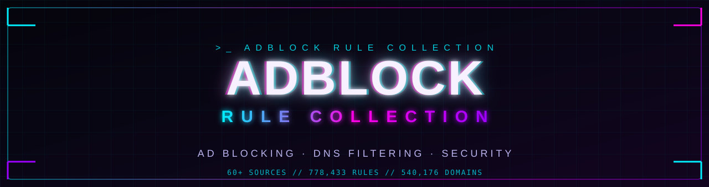
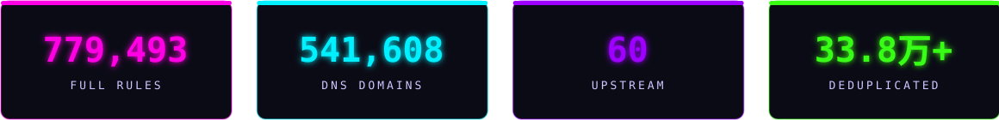

<div align="center">



<br/>

[](https://github.com/wansheng8/GZ/actions/workflows/build.yml)
[](dist/adblock_collection_full.txt)
[](dist/adblock_collection_full_dns.txt)
[](config/sources.yaml)
[](LICENSE)
[]()

**将 `60+` 上游列表转化 · 去重 · 合并为百万级广告拦截与 DNS 过滤规则**

`URL` · `域名` · `CSS` · `脚本` · `隐私` · `Cookie` · `恶意` · `钓鱼` · `挖矿`

<br/>

[]()
[]()
[]()
[]()
[]()
[]()
[]()

> **「 宁愿少拦截，不要误拦截 」**
> 内置 `DNS 安全分级` ▸ `误杀回归库` ▸ `质量门禁`，构建失败 **自动中止发布**

</div>


```diff
+ [ SYSTEM ONLINE ]  daily build @ 03:00 UTC  ::  订阅一次 · 自动更新 · 链接长期有效
```


每日 `03:00 UTC` 自动构建 · **订阅一次，自动更新** · 链接长期有效

| 订阅包 | 适用工具 | 一键导入 |
| :--- | :--- | :--- |
| **`[浏览器专用]`** 广告 + 隐私 + 安全 | uBlock Origin · AdGuard · AdBlock Plus | [](https://raw.githubusercontent.com/wansheng8/GZ/main/dist/adblock_collection_full.txt) [](https://cdn.jsdelivr.net/gh/wansheng8/GZ@main/dist/adblock_collection_full.txt) |
| **`[DNS · IPv4 hosts]`** 设备级拦截 | AdGuard Home · Pi-hole · dnsmasq | [](https://raw.githubusercontent.com/wansheng8/GZ/main/dist/adblock_collection_full_dns.txt) [](https://cdn.jsdelivr.net/gh/wansheng8/GZ@main/dist/adblock_collection_full_dns.txt) |
| **`[DNS · IPv6 hosts]`** 双栈设备补订 | AdGuard Home · Pi-hole · dnsmasq | [](https://raw.githubusercontent.com/wansheng8/GZ/main/dist/adblock_collection_full_dns_ipv6.txt) [](https://cdn.jsdelivr.net/gh/wansheng8/GZ@main/dist/adblock_collection_full_dns_ipv6.txt) |
| **`[单行域名列表]`** 纯域名格式 | AdGuard DNS · 各类域名过滤 | [](https://raw.githubusercontent.com/wansheng8/GZ/main/dist/adblock_collection_full_domains.txt) [](https://cdn.jsdelivr.net/gh/wansheng8/GZ@main/dist/adblock_collection_full_domains.txt) |
| **`[安全专项]`** 恶意 + 钓鱼 · 低误杀 | 只需安全拦截的设备 | [](https://raw.githubusercontent.com/wansheng8/GZ/main/dist/security/adblock_collection_security.txt) [](https://cdn.jsdelivr.net/gh/wansheng8/GZ@main/dist/security/adblock_collection_security.txt) |

```console
>_ 三步上手
  1. 按设备选一行（浏览器选第 1 条，DNS 设备选第 2~4 条）
  2. 点「订阅 GitHub」，国内访问慢就点「订阅 jsDelivr」
  3. 在过滤工具里「添加自定义过滤列表」并粘贴
```

> [!TIP]
> 仅需安全拦截：单独订阅「安全专项」行即可，绕过完整版的误杀风险。

<details>
<summary><code>纯文本订阅链接</code></summary>

```text
[浏览器专用]
https://raw.githubusercontent.com/wansheng8/GZ/main/dist/adblock_collection_full.txt
https://cdn.jsdelivr.net/gh/wansheng8/GZ@main/dist/adblock_collection_full.txt

[DNS · IPv4 hosts]
https://raw.githubusercontent.com/wansheng8/GZ/main/dist/adblock_collection_full_dns.txt
https://cdn.jsdelivr.net/gh/wansheng8/GZ@main/dist/adblock_collection_full_dns.txt

[DNS · IPv6 hosts]
https://raw.githubusercontent.com/wansheng8/GZ/main/dist/adblock_collection_full_dns_ipv6.txt
https://cdn.jsdelivr.net/gh/wansheng8/GZ@main/dist/adblock_collection_full_dns_ipv6.txt

[单行域名列表]
https://raw.githubusercontent.com/wansheng8/GZ/main/dist/adblock_collection_full_domains.txt
https://cdn.jsdelivr.net/gh/wansheng8/GZ@main/dist/adblock_collection_full_domains.txt

[安全专项]
https://raw.githubusercontent.com/wansheng8/GZ/main/dist/security/adblock_collection_security.txt
https://cdn.jsdelivr.net/gh/wansheng8/GZ@main/dist/security/adblock_collection_security.txt
```

</details>


<div align="center">



</div>

### ├─ 规则类型构成

| 类型 | 说明 |
| :--- | :--- |
|  | 域名 / URL / 资源请求阻断 |
|  | CSS 元素隐藏 |
|  | 脚本注入 / 反绕过 |
|  | HTML 过滤 |
|  | 脚本规则 |

### ├─ 按类别拆分 · `--split-by-category`

| 类别 | 订阅文件 `dist/adblock_collection_full_<类别>.txt` |
| :--- | :--- |
|  | [订阅](https://raw.githubusercontent.com/wansheng8/GZ/main/dist/adblock_collection_full_network.txt) |
|  | [订阅](https://raw.githubusercontent.com/wansheng8/GZ/main/dist/adblock_collection_full_privacy.txt) |
|  | [订阅](https://raw.githubusercontent.com/wansheng8/GZ/main/dist/adblock_collection_full_phishing.txt) |
|  | [订阅](https://raw.githubusercontent.com/wansheng8/GZ/main/dist/adblock_collection_full_annoyance.txt) |
|  | [订阅](https://raw.githubusercontent.com/wansheng8/GZ/main/dist/adblock_collection_full_cookie.txt) |
|  | 例外规则（仅供审计） |
|  | [订阅](https://raw.githubusercontent.com/wansheng8/GZ/main/dist/adblock_collection_full_social.txt) |
|  | [订阅](https://raw.githubusercontent.com/wansheng8/GZ/main/dist/adblock_collection_full_malware.txt) |
|  | 当前无独立规则 |

> [!NOTE]
> 每个类别均附带 `_dns.txt` / `_dns_ipv6.txt` / `_domains.txt` 版本。
> 只想订阅安全类别（malware / phishing / mining）时，可绕过完整版的误杀风险。


| | 能力 | 说明 |
| :--: | :--- | :--- |
|  | **多语法支持** | Adblock Plus / uBlock Origin / AdGuard / hosts / domains 全格式输出 |
|  | **分类发行** | 完整版 + 按类别拆分 + 安全类独立目录 |
|  | **防误杀体系** | DNS 三档安全分级 + 误杀回归库 + 质量门禁 |
|  | **来源血缘审计** | `provenance.json` 记录每条规则来源与置信度 |
|  | **阶段缓存** | 源内容 sha256 + 算法版本，增量构建秒级完成 |
|  | **自动更新** | GitHub Actions 每日 03:00 UTC 自动重建推送 |


去上方「订阅中心」表格按设备点选，常见软件入口：

- **uBlock Origin**：`设置 → 过滤规则列表 → 用户自定义 → 导入`，粘贴浏览器专用链接。
- **AdGuard（App / 桌面版）**：`设置 → 内容拦截 → 过滤器 → 自定义过滤器 → 添加过滤器`，粘贴链接。
- **AdGuard Home**：`过滤器 → DNS 拦截清单 → 添加拦截清单`，粘贴 DNS hosts 或域名列表链接。
- **Pi-hole / dnsmasq**：把 IPv4 hosts 列表加入自定义 adlist（`/etc/dnsmasq.d/` 或 Pi-hole 的 adlist 页面）。
- **双栈网络**：`_dns.txt` 与 `_dns_ipv6.txt` 同时订阅，避免 IPv6 绕过。
- **仅需安全拦截**：只订阅「安全专项」。

> [!TIP]
> 国内直连 GitHub 慢时，统一改用 jsDelivr 列，订阅体验更稳。


```bash
pip install -r requirements.txt

# 完整版 + 类别拆分 + DNS + 冗余消除
python -m adblock_collection build --out dist --split-by-category --redundant

# 常用子命令
python -m adblock_collection sources               # 列出上游列表
python -m adblock_collection regression            # 误杀回归校验
python -m adblock_collection stats --out dist      # 仅刷新统计与 manifest
```

构建选项：`--no-dns`（不生成 DNS 文件）· `--offline`（仅用缓存）· `--no-cache`（禁用下载缓存）· `--dns-policy safe`（DNS 安全分级）。

缓存位于 `.cache/sources/` 与 `.cache/parsed/`，首次下载后离线可重建。


### ├─ `[1]` DNS 安全分级 · dns_policy

DNS 规则在解析层生效、无法限定上下文，误杀代价最高，故分三档：

| 级别 | 行为 | 误杀风险 |
| :--- | :--- | :---: |
|  | 纳入所有纯域名网络规则 | 中 |
|  | 仅纯域名 + 带 `$third-party` 等修饰符规则 | 低 |
|  | 仅最不易误杀的纯域名规则 | 最低 |

### ├─ `[2]` 误杀回归库 · regression

`config/false_positives.yaml` 内置 `40+` 主流站点（Google、百度、微信、支付宝、GitHub、银行电商）回归清单：
命中即 **构建失败（exit 1）**，防止误拦关键站点。

### ├─ `[3]` 质量门禁 · quality_gate

构建对比上一轮基线 `previous_metrics.json`，下列异常直接失败：
单源规则数骤降 `>50%` · 规则总量骤降 `>50%` · DNS 域名骤降 `>50%`。报告写入 `dist/build_report.json`。

### └─ `[4]` 来源血缘 · provenance

- `provenance.json`：每条规则记录来源、所属独立源组、置信度
  `conf = min(1.0, 0.5 + 0.1 × 独立源组数)`
- `relation_graph.json`：识别父子域冗余 / 跨源重复 / 阻断与例外冲突三类关系

> [!IMPORTANT]
> 三档分级与回归库共同构成发布闸门：任一校验失败，构建直接中止，不会产出有风险的新规则。


编辑 `config/sources.yaml`：

```yaml
sources:
  - name: My Custom List
    url: https://example.com/my-filter.txt
    category: network      # network / privacy / cookie / social / malware / phishing / mining / annoyance
    compatible: [adguard, abp, ubo]
    dns_policy:
      level: strict-safe   # all / safe / strict-safe
```


```
adblock_collection/
  rules.py        规则解析 · 规范化 · 分类 · 类型识别
  merge.py        上游下载 · 合并 · 去重 · badfilter · 冗余消除
  writer.py       多格式输出（adblock / hosts / domains / stats）
  dns_policy.py   DNS 安全分级
  regression.py   误杀回归校验
  quality_gate.py 质量门禁与基线
  pipeline.py     阶段缓存与算法版本常量
  provenance.py   来源血缘与语义关系图
  cli.py          命令行入口
config/
  sources.yaml            上游配置（dns_policy / quality_gate / security_policy）
  false_positives.yaml    误杀回归清单
tests/
  test_collection.py      单元与端到端测试
  test_relation_graph.py
.github/workflows/build.yml   每日自动构建并推送
```


> [!CAUTION]
> 本过滤器 **可能破坏某些网站功能**，或 **阻断部分成人 / 赌博站点**。
> 如有误杀，请向上游列表反馈；本仓库仅提供去重、转化、合并，不参与内容判定。


<div align="center">


[](LICENSE)

```diff
- [ CONNECTION TERMINATED ]  system.exit(0)  ::  stay clean, stay unblocked
```

</div>
